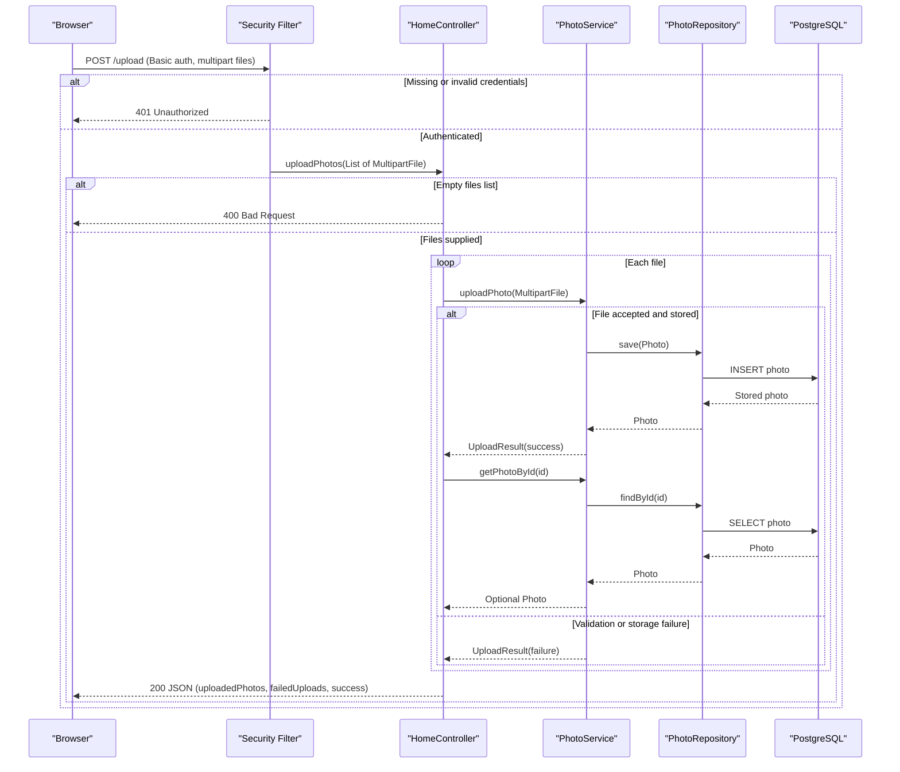

# API & Service Communication Contracts

Five application endpoints serve HTML pages, a multipart upload with a JSON response, and photo bytes. Requests are handled synchronously within one application; there are no inter-application API calls or asynchronous messaging flows.

## Service Catalog

| Service | Port | Category | Purpose |
| --- | --- | --- | --- |
| `photo-album` (`photoalbum-java-app` in Compose; `photoalbum` in Azure Container Apps) | 8080 (Compose publishes 8080:8080) | Business | Gallery, photo upload, detail, deletion, and image delivery. Uses Spring MVC, Thymeleaf, Spring Data JPA, and Spring Security. |
| `postgres-db` (third-party `postgres:17-alpine` Compose image; managed PostgreSQL in Azure) | 5432 in Compose | Infrastructure | Persistent photo storage accessed via JDBC/JPA; not a source-built HTTP service. |

The Maven build has one deployable module. The Azure infrastructure provisions a single Container App for the application, not additional application services.

## API Endpoints Inventory

| Service / controller | Method | Path | Request Type | Response Type |
| --- | --- | --- | --- | --- |
| `photo-album` / `HomeController` | GET | `/` | None | `index` HTML view with `List<Photo>` model; 200, including an empty gallery if loading fails. |
| `photo-album` / `HomeController` | POST | `/upload` | `multipart/form-data`, repeated `files` parts (`List<MultipartFile>`); HTTP Basic credentials required | JSON `Map<String, Object>` with success flag, uploaded photo summaries and failed upload summaries; 200 for processed uploads, including per-file failures; 400 for an empty files list or missing required part (framework binding); 401 without valid credentials. |
| `photo-album` / `DetailController` | GET | `/detail/{id}` | `id` string path parameter | `detail` HTML view with `Photo` and navigation IDs; 200 when found, 302 redirect to `/` when missing or on error. |
| `photo-album` / `DetailController` | POST | `/detail/{id}/delete` | `id` string path parameter; HTTP Basic credentials required | 302 redirect to `/` with success/error flash message (including not found or deletion failure); 401 without valid credentials. |
| `photo-album` / `PhotoFileController` | GET | `/photo/{id}` | `id` string path parameter; optional client cache-busting query parameter is ignored by the controller | `Resource` (`ByteArrayResource`) with photo MIME type and no-cache/photo metadata headers; 200, 404 if absent or empty, 500 on retrieval error. |

There is no explicit API versioning by path, header, or query parameter. Static assets are served by the web framework, not separate controller API contracts.

## Management & Observability Endpoints

| Service | Endpoint | Custom Metrics (if any) |
| --- | --- | --- |
| `photo-album` | No Actuator, custom health, Swagger UI, or metrics endpoint defined | None; no `@Timed` or custom meter registration found. |
| `postgres-db` | PostgreSQL protocol on 5432; Compose uses a database readiness command, not an HTTP management endpoint | None defined by this project. |

## DTOs & Contracts

`MultipartFile` is the upload request type; `Photo` is a mutable service-owned domain entity used as the HTML model for the gallery/detail views and as the source of image data. `UploadResult` is a mutable internal service result used by `HomeController`, not serialized directly. The upload endpoint constructs mutable `Map<String, Object>` JSON responses and nested maps rather than named request/response DTO classes. The image response is a Spring `Resource`, not a JSON DTO. No gateway-level composition DTOs, immutable records, OpenAPI/Swagger specification, protobuf schema, or GraphQL schema were found. JSON uses the included Spring JSON serialization support; no custom serializer configuration was found. Entity/persistence details belong in `data-architecture.md`.

## Communication Patterns

- **Synchronous:** Browser navigation and `fetch('/upload')` call MVC controllers over HTTP. Controllers call `PhotoService` directly; `PhotoServiceImpl` uses `PhotoRepository` and JDBC/JPA to talk to PostgreSQL. Gallery/detail views render on the server. The browser separately requests photo bytes via `/photo/{id}`. There is no REST/gRPC client to another application service.
- **Asynchronous:** None at the service boundary; no message broker, pub/sub, or event producer/consumer is configured. Browser `fetch` is asynchronous JavaScript but its server exchange is ordinary request/response HTTP.
- **Gateway and discovery:** No API gateway, gateway aggregation, fallback composition, service registry, or client-side load balancer. The application connects to PostgreSQL via its configured database address (Compose DNS name locally or a managed database endpoint in Azure).
- **Resilience:** No application-level circuit breaker, retry, bulkhead, explicit downstream request timeout, or fallback to another service is configured. Upload records individual file failures in its 200 JSON result; gallery loading falls back to an empty HTML gallery, detail errors redirect to `/`, and photo byte retrieval errors return 500. These are controller error paths, not circuit-breaker fallbacks. Compose waits for the database to be healthy before starting the app; database availability affects successful API operations. See `configuration-inventory.md` for startup details.
- **Security:** GET routes are public. POST `/upload` and POST `/detail/{id}/delete` require authenticated HTTP Basic credentials backed by one configured in-memory admin account; the rule checks authentication, not the `ADMIN` role. Requests are stateless and CSRF protection is disabled. The application itself has no HTTPS/TLS listener configured; Azure Container Apps ingress disallows insecure external traffic and exposes an HTTPS URL, while local Compose publishes the app's HTTP port directly. Database identity/password mechanisms are not HTTP API authentication.

## Service Technology Matrix

| Service | Web | Data Access |
| --- | --- | --- |
| `photo-album` | Spring MVC with Thymeleaf and JSON responses | Spring Data JPA / JDBC to PostgreSQL |
| `postgres-db` | None (database protocol only) | PostgreSQL storage |

Discovery, gateway, Actuator, cache, and metrics-export columns are omitted because none of the services implements those capabilities in the project.

## Service Communication Sequence

All calls in this flow are synchronous; dashed arrows represent responses. A missing required multipart part is rejected with 400 during MVC binding, before `uploadPhotos` runs. There is no gateway, broker, retry, or circuit-breaker branch.
