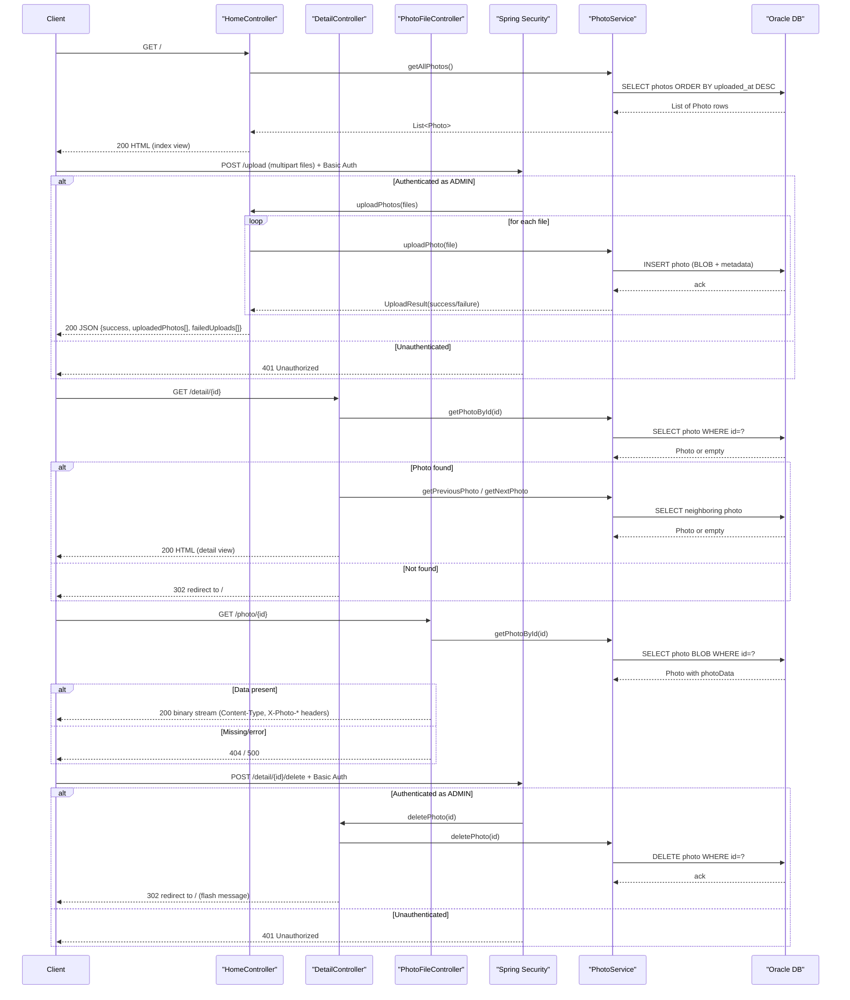

# API & Service Communication Contracts

The application exposes a small surface of 5 HTTP endpoints (3 server-rendered MVC routes, 1 JSON upload API, 1 binary file-serving route) with no inter-service calls — all communication is synchronous, in-process, request/response over HTTP.

## Service Catalog

| Service | Port | Category | Purpose |
|---|---|---|---|
| photoalbum-java-app | 8080 | Business (monolith) | Single Spring Boot MVC application serving the photo gallery UI, upload API, and photo BLOB streaming |
| oracle-db (gvenzl/oracle-free) | 1521 | Infrastructure (third-party container) | Oracle Database Free 23ai instance storing photo metadata and BLOB data; not a source-built service |

This is a single-module, single-deployable Spring Boot application (no Maven multi-module, no API gateway, no service discovery). The `docker-compose.yml` defines only these two containers.

## API Endpoints Inventory

| Service | Method | Path | Request Type | Response Type |
|---|---|---|---|---|
| photoalbum-java-app (HomeController) | GET | `/` | none | HTML view `index` (model: `List<Photo>`, `timestamp`) |
| photoalbum-java-app (HomeController) | POST | `/upload` | `multipart/form-data`: `List<MultipartFile> files` | JSON `Map<String,Object>` — `success`, `uploadedPhotos[]`, `failedUploads[]` (200 / 400) |
| photoalbum-java-app (DetailController) | GET | `/detail/{id}` | Path param `id` (String/UUID) | HTML view `detail` (model: `Photo`, `previousPhotoId`, `nextPhotoId`); redirects to `/` if not found |
| photoalbum-java-app (DetailController) | POST | `/detail/{id}/delete` | Path param `id` | Redirect to `/` with flash message (`successMessage`/`errorMessage`) |
| photoalbum-java-app (PhotoFileController) | GET | `/photo/{id}` | Path param `id` | Binary photo stream (`Resource`, `Content-Type` from `Photo.mimeType`, custom headers `X-Photo-ID`, `X-Photo-Name`, `X-Photo-Size`); 404 if missing, 500 on error |

No API versioning scheme is present (no version segment, header, or query parameter). No REST/JSON API beyond `/upload`; the rest are traditional server-rendered MVC endpoints.

## Management & Observability Endpoints

No Spring Boot Actuator dependency is present in `pom.xml`, and no custom health, metrics, or Swagger/OpenAPI endpoints were found. The application exposes no management or observability endpoints.

## DTOs & Contracts

- **`Photo`** (`com.photoalbum.model`) — JPA entity, doubles as the response/view model returned directly to Thymeleaf templates and referenced by the upload JSON response. Mutable (JavaBean with setters). See `data-architecture.md` for full field/persistence details.
- **`UploadResult`** (`com.photoalbum.model`) — plain service-layer result object (request/response DTO between `PhotoService` and `HomeController`), mutable JavaBean; not persisted, not exposed directly as JSON (its fields are copied into ad-hoc `Map<String,Object>` structures in `HomeController.uploadPhotos`).
- The `/upload` JSON response body is built dynamically with `HashMap`/`ArrayList` rather than a dedicated response DTO class — there is no formal response schema class for this endpoint.
- No gateway-level aggregation DTOs exist (single-service app). No OpenAPI/Swagger spec, no `.proto`, and no GraphQL schema were found.
- Serialization uses Spring Boot's default Jackson (via `spring-boot-starter-json`) with no custom `ObjectMapper` configuration.

## Communication Patterns

- **Synchronous only**: All communication is direct HTTP request/response handled by Spring MVC controllers calling `PhotoService` in-process; no HTTP client (RestTemplate/WebClient/Feign) or gRPC calls exist.
- **Asynchronous/messaging**: None — no message broker, queue, or event/pub-sub pattern is used.
- **Resilience patterns**: None configured — no circuit breaker (Resilience4j/Polly), retry policy, or timeout library is present. Controllers use simple `try/catch` blocks returning HTTP 404/500 or redirecting on error.
- **Service discovery / gateway**: Not applicable — single deployable service, no Eureka/Consul, no Spring Cloud Gateway; the app connects to Oracle via a hardcoded JDBC URL (`jdbc:oracle:thin:@oracle-db:1521/FREEPDB1`, overridable via env var).
- **Gateway aggregation**: Not applicable — no gateway or multi-service composition exists.
- **Startup dependency chain**: `docker-compose.yml` makes the app wait on `oracle-db` reaching `service_healthy` before starting, which directly affects API availability at boot (see `configuration-inventory.md` for probe/wait details).
- **Security posture**: Spring Security is configured with HTTP Basic authentication (stateless, `SessionCreationPolicy.STATELESS`, CSRF disabled). Only the state-changing endpoints — `POST /upload` and `POST /detail/{id}/delete` — require authentication (`ROLE_ADMIN`, credentials from environment variables). All other endpoints, including `GET /`, `GET /detail/{id}`, and `GET /photo/{id}` (which streams raw photo BLOBs), are publicly accessible with no authorization checks. No TLS/HTTPS is configured at the application level (plain HTTP on port 8080).

## Service Technology Matrix

| Service | Web | Data Access | Discovery | Gateway | Actuator | Cache | Metrics |
|---|---|---|---|---|---|---|---|
| photoalbum-java-app | Spring MVC (Thymeleaf + REST for `/upload`) | Spring Data JPA (Hibernate, Oracle dialect) | None | None | Not present | None | None |

## Service Communication Sequence

