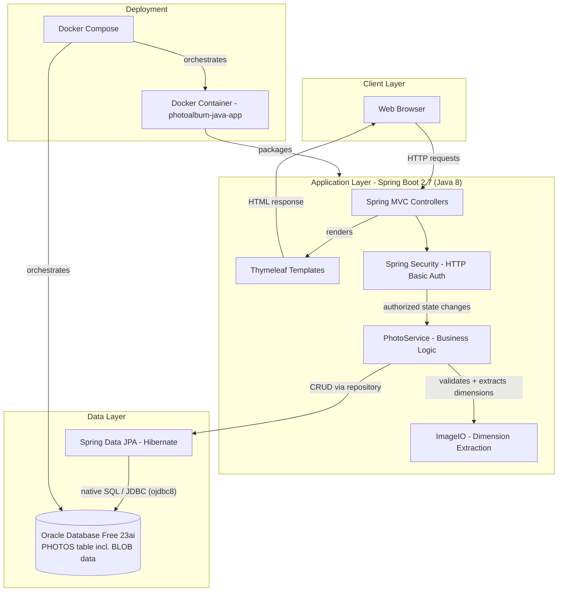
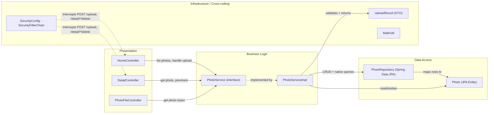

# Architecture Diagram

Photo Album is a monolithic Spring Boot 2.7 web application that lets users browse, upload, view, and delete photos, with binary image data persisted directly as BLOBs in an Oracle database.

## Application Architecture

### Technology Stack Summary

| Layer | Technology | Version | Purpose |
|-------|-----------|---------|---------|
| Presentation | Thymeleaf | Spring Boot 2.7 starter | Server-side HTML templating for gallery and detail views |
| Web/API | Spring MVC | Spring Boot 2.7.18 | REST/MVC controllers for pages, upload API, and file serving |
| Security | Spring Security | Spring Boot 2.7 starter | Stateless HTTP Basic auth protecting upload/delete endpoints |
| Business Logic | Spring Service beans | Spring Boot 2.7 | Photo validation, upload processing, navigation logic |
| Image Processing | javax.imageio (ImageIO) | JDK 8 | Reads image header/dimensions without full decode (DoS mitigation) |
| Data Access | Spring Data JPA / Hibernate | Spring Boot 2.7 starter | Entity mapping and native Oracle-specific queries |
| Database Driver | Oracle JDBC (ojdbc8) | runtime dependency | Connectivity to Oracle database |
| Database | Oracle Database Free 23ai | gvenzl/oracle-free:latest (Docker) | Stores photo metadata and BLOB image data |
| Runtime | Java | 1.8 | Application language/runtime target |
| Containerization | Docker / Docker Compose | - | Packages app and orchestrates it with the Oracle DB service |

### Data Storage & External Services

The application uses a single Oracle Database (23ai Free edition, run via the `gvenzl/oracle-free` Docker image) as its only persistent store. Photo binary content, metadata (filename, size, MIME type, dimensions), and upload timestamps are all stored in one `PHOTOS` table, with the raw image bytes kept as a `BLOB` column rather than on the filesystem or in external object storage. There are no other external service integrations (no email, message queues, or third-party APIs); Docker Compose wires the app container to the Oracle container over an internal bridge network, with the app waiting on the database's health check before starting.

### Key Architectural Decisions

- **Database-backed BLOB storage** instead of filesystem storage means photos are fully contained in Oracle, simplifying backup/restore but coupling image serving performance to database I/O.
- **Oracle-specific native queries** (ROWNUM pagination, `TO_CHAR`, analytic `RANK()`/`SUM() OVER`) are used directly in `PhotoRepository`, tying the data layer tightly to Oracle SQL dialect and complicating a future database migration.
- **Stateless security model**: Spring Security enforces HTTP Basic auth only on state-changing endpoints (upload/delete) with CSRF disabled and no server-side sessions, while the gallery itself remains publicly readable.

## Component Relationships

### Component Inventory

| Component | Layer | Type | Responsibility |
|-----------|-------|------|-----------------|
| HomeController | Presentation | MVC Controller | Renders gallery page and handles multi-file photo uploads |
| DetailController | Presentation | MVC Controller | Renders single photo detail view with prev/next navigation and handles delete |
| PhotoFileController | Presentation | REST Controller | Serves raw photo bytes from the database BLOB by ID |
| PhotoService | Business Logic | Service Interface | Defines contract for photo retrieval, upload, deletion, and navigation |
| PhotoServiceImpl | Business Logic | Service Implementation | Validates uploads, extracts image dimensions safely, orchestrates persistence |
| PhotoRepository | Data Access | Spring Data JPA Repository | Executes Oracle-specific native SQL queries (ordering, pagination, stats, navigation) |
| Photo | Data Access | JPA Entity | Maps to `PHOTOS` table; holds metadata and BLOB image data |
| UploadResult | Infrastructure | DTO | Carries success/failure state and error messages for upload operations |
| SecurityConfig | Infrastructure | Security Configuration | Configures stateless HTTP Basic auth restricting upload/delete endpoints |
| MathUtil | Infrastructure | Utility | Helper utility class supporting business logic |
