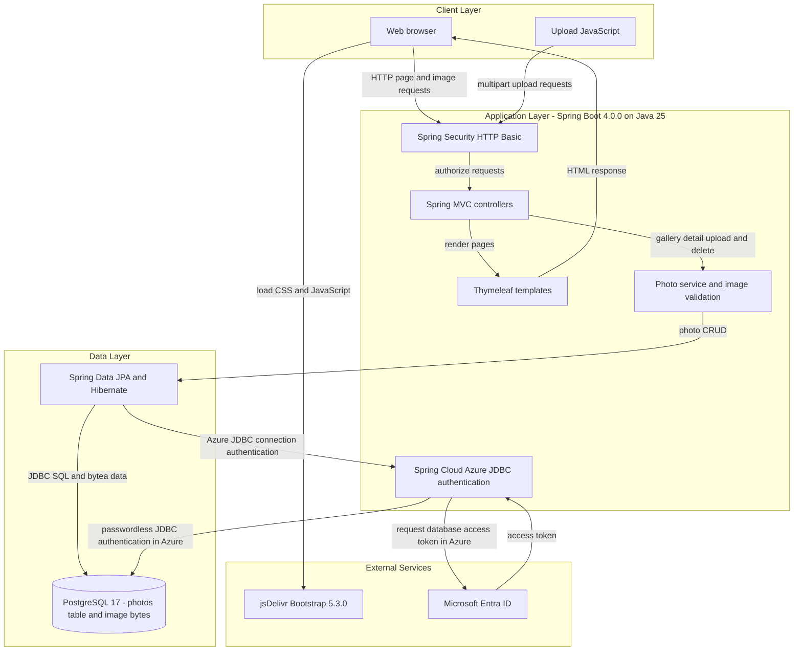
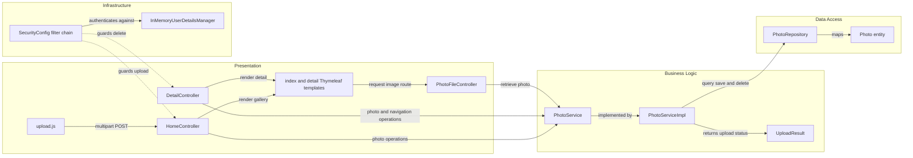

# Architecture Diagram

Photo Album is a single Spring Boot web application for browsing, uploading, and deleting photos. It renders gallery and detail pages with Thymeleaf and stores photo metadata and image bytes in PostgreSQL.

## Application Architecture

### Technology Stack Summary

| Layer | Technology | Version | Purpose |
| --- | --- | --- | --- |
| Runtime | Java and Spring Boot | Java 25; Spring Boot 4.0.0 | Run the web application |
| Presentation | Spring MVC and Thymeleaf | Managed by Spring Boot 4.0.0 | Handle HTTP routes and render gallery and detail pages |
| Browser | Vanilla JavaScript and Bootstrap | JavaScript version not specified; Bootstrap 5.3.0 | Submit uploads with Fetch and style pages |
| Security | Spring Security | Managed by Spring Boot 4.0.0 | Require HTTP Basic authentication for upload and delete while allowing reads |
| Business logic | PhotoService and PhotoServiceImpl | Application 1.0.0 | Validate images and coordinate photo operations |
| Data access | Spring Data JPA, Hibernate and PostgreSQL JDBC | Managed by Spring Boot 4.0.0 | Persist and query photo entities |
| Storage | PostgreSQL | 17 in Docker Compose | Store photo metadata and bytes in the `photos` table |
| Azure authentication | Spring Cloud Azure JDBC PostgreSQL and Microsoft Entra ID | Spring Cloud Azure 7.4.0 | Authenticate to Azure Database for PostgreSQL without an application password |

### Data Storage & External Services

PostgreSQL stores metadata and image bytes in the `photos` table, with the image content mapped to a `bytea` column; stored file paths are compatibility metadata, not an active file store. Docker Compose uses a persistent PostgreSQL 17 volume and password authentication; the default configuration targets Azure Database for PostgreSQL with Microsoft Entra managed identity and passwordless JDBC authentication. Browsers load Bootstrap from jsDelivr. No cache, message broker, object storage service, or other application API is configured.

### Key Architectural Decisions

- Controllers inject the `PhotoService` interface; its transactional implementation uses a Spring Data JPA repository with native PostgreSQL queries for chronological browsing.
- Gallery and detail pages are server-rendered, while upload JavaScript submits multipart requests to a JSON-returning controller; a separate controller serves image bytes by ID.
- A stateless Spring Security filter chain allows public reads and requires HTTP Basic authentication for upload and delete, using an in-memory admin account configured from environment properties.

## Component Relationships

### Component Inventory

| Component | Layer | Type | Responsibility |
| --- | --- | --- | --- |
| `index.html`, `detail.html` | Presentation | Thymeleaf templates | Display gallery, photo detail, navigation, and delete form; request photo URLs |
| `upload.js` | Presentation | Browser script | Validate selected files and submit multipart uploads using Fetch |
| `HomeController` | Presentation | MVC controller | Render gallery and return JSON upload results |
| `DetailController` | Presentation | MVC controller | Render photo details and handle deletion |
| `PhotoFileController` | Presentation | MVC controller | Return photo bytes and content type by ID |
| `PhotoService` | Business Logic | Service interface | Define listing, lookup, upload, navigation, and deletion operations |
| `PhotoServiceImpl` | Business Logic | Transactional service | Validate file size and MIME type, read image dimensions, and coordinate persistence |
| `UploadResult` | Business Logic | Result object | Carry per-file upload status, photo ID, and error details |
| `PhotoRepository` | Data Access | Spring Data JPA repository | Provide CRUD and native PostgreSQL queries |
| `Photo` | Data Access | JPA entity | Map the `photos` table, including metadata and binary image data |
| `SecurityConfig` | Infrastructure | Security configuration | Configure stateless HTTP Basic, authorization rules, and password encoding |
| `InMemoryUserDetailsManager` | Infrastructure | User store | Hold the configured admin account with a BCrypt-encoded password |
