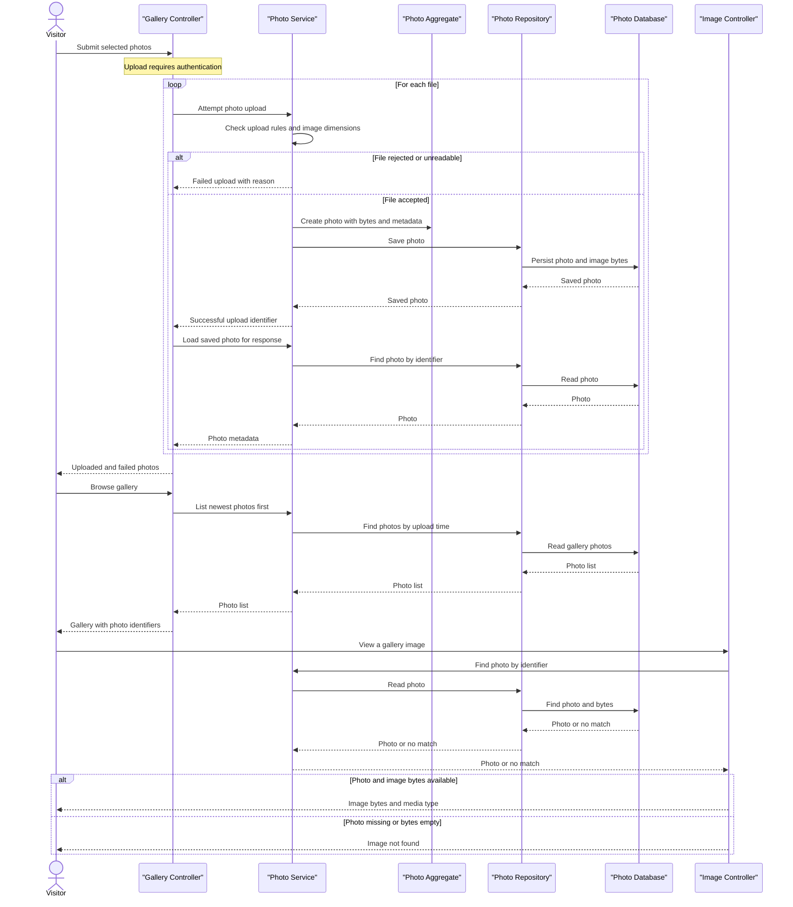

# Core Business Workflows

Photo Album lets visitors browse and view photos while authenticated users upload and remove them. Each photo is managed as an independent item in one shared gallery.

## Domain Entities

| Entity | Service / Bounded Context | Description | Key Relationships |
|---|---|---|---|
| Photo | Photo Album / Photo Gallery | Aggregate root representing an uploaded image and the information needed to display it. | Independent of other domain entities; its upload time determines gallery order and adjacent-photo navigation. |
| UploadResult | Photo Album / Photo Gallery | Transient outcome of one upload attempt, identifying a saved photo or explaining a rejection. | Produced for a single attempted Photo upload; never persisted. |

## Service-to-Domain Mapping

| Service | Domain Context | Owned Entities | External Dependencies |
|---|---|---|---|
| Photo Album application (single deployable service) | Photo Gallery | Photo; produces UploadResult | PostgreSQL is the persistence store for photo records and image bytes. The browser consumes gallery pages, upload results and photo content from this same service. |

There are no independently deployed domain services, shared cross-service identifiers, events or gateway aggregations. `PhotoServiceImpl` owns photo operations within the application; `PhotoRepository` persists the Photo aggregate.

## Primary Workflows

### Workflow 1: Upload Photos

1. An authenticated user selects or drops files; the browser filters unsupported types and oversized files before submitting `POST /upload`. Server-side checks remain authoritative.
2. `HomeController` rejects a request with no files. For each submitted file, `PhotoServiceImpl` applies the upload validation rules, reads the bytes, and inspects the image header for dimensions. A dimension-extraction error can leave dimensions unavailable without preventing the save; an over-limit pixel count rejects that file.
3. The service creates a Photo with a new identifier, upload time, original filename, image bytes and display metadata, then persists it via `PhotoRepository`. Its generated compatibility path is not where the image is served from.
4. The controller resolves each successful photo for response metadata and returns separate uploaded and failed lists. One rejected file does not prevent later files from being attempted; the response's overall success flag is true when at least one uploaded photo is included. The browser adds successful uploads to the gallery and shows per-file errors.

### Workflow 2: Browse and View Photos

1. Any visitor requests `GET /`. `HomeController` loads photos via `PhotoServiceImpl` and `PhotoRepository` in newest-first upload order and renders gallery cards, or an empty-gallery message when there are no results. If loading throws, it logs the error and renders an empty list.
2. The visitor opens `GET /detail/{id}`. `DetailController` resolves the Photo and queries the nearest older and newer photos by upload time. It renders metadata and navigation links only for neighbors found; a missing photo, invalid blank ID or retrieval exception redirects to the gallery.
3. Gallery and detail images trigger separate `GET /photo/{id}` requests. `PhotoFileController` retrieves the Photo and returns its stored bytes with the photo's MIME type and no-cache headers. A missing photo or empty image data produces 404; an exception produces 500.

### Workflow 3: Delete a Photo

An authenticated user confirms deletion in the detail page and submits `POST /detail/{id}/delete`. `DetailController` asks `PhotoServiceImpl` to find and remove the Photo via `PhotoRepository`. It redirects to the gallery with a success message when deleted, a not-found message when absent, or an error message if deletion throws. Since bytes belong to the same Photo record, deletion removes the image content as well.

## Cross-Service Data Flows

No cross-service business data composition or circuit breaker exists. Within the application, controllers combine Photo data from `PhotoServiceImpl`: upload results are enriched with saved-photo metadata, the detail page combines the selected Photo with its chronological neighbors, and the browser loads image bytes separately by Photo ID. PostgreSQL is the source of truth for both image bytes and display metadata. A failed gallery read renders an empty gallery rather than a partial result from another service; failed image reads return 404 or 500 as described above. There is no cross-service fallback.

## Business Workflow Sequence

## Business Rules & Decision Logic

- **Upload validation:** The browser accepts JPEG, PNG, GIF and WebP and screens files larger than 10 MB. The service enforces its configured MIME allow-list (case-insensitive on the submitted type), maximum size (default 10 MiB), nonempty file size and a maximum of 40 million image pixels when dimensions can be read. Unreadable file bytes fail the upload; inability to extract dimensions without an I/O error can still result in a saved photo without dimensions. Multipart request limits are 10 MB per file and 50 MB per request. A configured `max-files-per-upload` setting exists but is not enforced in the controller or service.
- **Photo integrity and lifecycle:** Creation assigns a unique Photo ID and upload time; an additional unique stored filename and compatibility path are generated, but images are served from the Photo's stored bytes. A Photo is either saved or absent/deleted; there are no approval or publication states and no relationships to maintain.
- **Ordering and derived display values:** Gallery order is descending by upload time. Detail navigation uses strictly earlier upload times for the nearest older photo and strictly later times for the nearest newer photo; photos with identical timestamps are not neighbors under these queries. The UI formats upload time and file size and shows dimensions only when available.
- **Batch decisions and errors:** Files are attempted independently. Invalid files yield per-file errors and do not block other uploads. Empty file lists return a bad-request response; missing detail photos redirect home, missing/depleted image data returns 404, and deletion of an absent photo produces a not-found flash message. A failed image retrieval returns 500, while a gallery retrieval failure is logged and displayed as an empty list. Service upload read/save errors are logged and converted to failed results.
- **Transactions and access:** Photo service methods run in a transaction, with read-only transactions for listing, lookup and navigation; there is no distributed transaction or compensation across files. Gallery, detail and image requests are public. Upload and deletion require authentication through HTTP Basic with an in-memory admin account, but there is no per-photo ownership rule. Upload and deletion events and errors are logged; no domain event stream or dedicated audit history is implemented.
