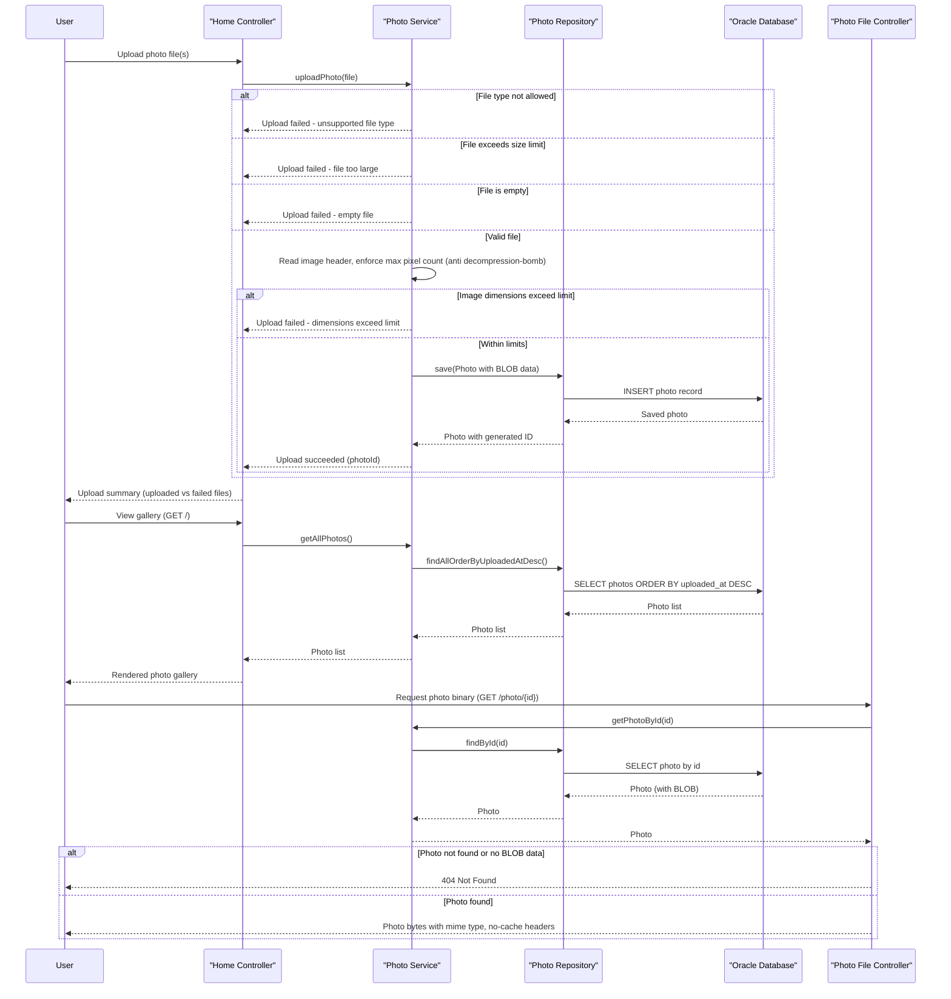

# Core Business Workflows

PhotoAlbum is a simple web-based photo gallery application that lets users upload, browse, view, and delete photos stored as binary data in an Oracle database.

## Domain Entities

| Entity | Service / Bounded Context | Description | Key Relationships |
|---|---|---|---|
| Photo | Photo Gallery (single module) | Represents an uploaded photo with its binary content and display metadata (dimensions, upload timestamp). The aggregate root of the application. | Standalone entity — no relationships to other entities. Ordered/queried by `uploadedAt` to support gallery listing and prev/next navigation. |
| UploadResult | Photo Gallery (single module) | Transient (non-persisted) value object representing the outcome of a single file upload attempt — either success (with the new photo's ID) or failure (with an error message). | Produced by the upload workflow for each `Photo` created; not stored. |

## Service-to-Domain Mapping

This is a single-module monolithic Spring Boot application — there is only one bounded context and no cross-service composition.

| Service | Domain Context | Owned Entities | External Dependencies |
|---|---|---|---|
| photoalbum (single Spring Boot app) | Photo Gallery Management | Photo | Oracle database (photo BLOB storage via `PhotoRepository`); in-memory admin user store for authentication |

## Primary Workflows

### Workflow 1: Browse Photo Gallery

- Entry point: `GET /` (`HomeController.index`)
- Flow: Controller calls `PhotoService.getAllPhotos()` → `PhotoRepository.findAllOrderByUploadedAtDesc()` retrieves all photos ordered newest-first → results bound to the view model for gallery rendering.
- Business rule: On any retrieval error, the gallery degrades gracefully by rendering an empty photo list rather than failing the page.
- No authentication required — the gallery is publicly readable.

### Workflow 2: Upload Photo(s)

- Entry point: `POST /upload` (`HomeController.uploadPhotos`), requires authentication (see Business Rules).
- Flow (per file, `PhotoServiceImpl.uploadPhoto`):
  1. Reject request immediately if no files were provided.
  2. For each file: validate MIME type is in the configured allow-list (JPEG, PNG, GIF, WebP); reject unsupported types.
  3. Validate file size against the configured maximum (`app.file-upload.max-file-size-bytes`); reject oversized files.
  4. Reject empty (zero-length) files.
  5. Generate a unique stored filename (UUID + original extension) for compatibility purposes.
  6. Read the file's raw bytes and inspect the image header only (no full decode) to extract width/height, enforcing a maximum decoded-pixel-count limit (40M pixels) to prevent decompression-bomb denial-of-service; dimension extraction failures are non-fatal and the upload proceeds without dimensions.
  7. Persist a new `Photo` entity (with binary content as a BLOB, metadata, and dimensions) via `PhotoRepository.save`.
  8. Build a per-file `UploadResult` (success with new photo ID, or failure with a descriptive error).
  9. Controller aggregates results across all files into a response distinguishing `uploadedPhotos` from `failedUploads`; overall `success` is true if at least one file uploaded successfully.
- Business rules involved: file-type allow-list, max file-size limit, non-empty file requirement, decompression-bomb pixel-count limit (see Business Rules section).

### Workflow 3: View Photo Detail with Navigation

- Entry point: `GET /detail/{id}` (`DetailController.detail`)
- Flow: Look up the photo by ID; if missing, redirect to the gallery home. Otherwise, load the photo plus its "previous" (older) and "next" (newer) neighbors via `PhotoService.getPreviousPhoto`/`getNextPhoto`, which query photos strictly before/after the current photo's `uploadedAt` timestamp, ordered to pick the single nearest neighbor. Renders the detail view with prev/next links for chronological browsing.

### Workflow 4: Serve Photo Binary

- Entry point: `GET /photo/{id}` (`PhotoFileController.servePhoto`)
- Flow: Look up the photo by ID; if not found or its BLOB data is empty, return 404. Otherwise stream the binary content back with its stored MIME type and aggressive no-cache headers (ensuring browsers always fetch the latest version, e.g., after a delete/re-upload with a reused path).

### Workflow 5: Delete Photo

- Entry point: `POST /detail/{id}/delete` (`DetailController.deletePhoto`), requires authentication (see Business Rules).
- Flow: Look up the photo by ID; if found, delete it from the database and set a success flash message; if not found, set an error flash message. Always redirects back to the gallery home page.

## Cross-Service Data Flows

Not applicable — this is a single-module monolithic application with no service-to-service composition, gateway aggregation, or circuit-breaker fallback behavior. All workflows execute entirely within one Spring Boot process against a single Oracle database.

## Business Workflow Sequence

## Business Rules & Decision Logic

**Validation rules (upload):**
- MIME type allow-list check: only configured content types (JPEG, PNG, GIF, WebP) are accepted; all others are rejected with a descriptive error.
- Max file size check: files larger than `app.file-upload.max-file-size-bytes` are rejected.
- Non-empty file check: zero-length files are rejected.
- Decompression-bomb guard: image dimensions are read from the file header only (not a full decode); if width × height exceeds 40,000,000 pixels, the upload is rejected before any full image decoding occurs.

**State transitions:**
- Photo lifecycle is simple: Created (on successful upload) → Deleted (on delete). There is no "edit"/"update" workflow — photos are immutable once uploaded.

**Business constraints:**
- Photo IDs are system-generated UUIDs, guaranteeing uniqueness without relying on user input.
- Chronological ordering (`uploadedAt`) drives both gallery listing (newest first) and detail-page prev/next navigation (nearest neighbor by timestamp).

**Computed values:**
- Image width/height are derived (not user-supplied) by inspecting the uploaded file's header at upload time.
- Stored filename is derived from a generated UUID plus the original file extension, decoupled from the user-supplied original filename (used only for display).

**Authorization:**
- State-changing operations (`POST /upload`, `POST /detail/{id}/delete`) require HTTP Basic authentication against a single in-memory admin account (credentials from environment variables, not hard-coded).
- All read operations (gallery listing, photo detail view, photo binary serving) are publicly accessible without authentication.
- Authentication is stateless (no server-side session); CSRF protection is disabled since there is no session-based token to protect and Basic auth is used per-request.

**Error handling:**
- Gallery listing degrades to an empty list on unexpected errors rather than failing the page.
- Detail view and delete operations redirect back to the gallery home with a flash error message on failure, rather than showing a raw error page.
- Photo-serving and repository-level errors are logged and surfaced as HTTP error responses (404/500) without leaking internal details to the client.

**Audit/logging:**
- Upload rejections (invalid type, oversized, invalid dimensions), successful uploads, deletions, and retrieval errors are logged with contextual details (filename, size, photo ID) for traceability.

**Transactions:**
- The service layer is transactional (`@Transactional`), with read-only transactions for query operations (`getAllPhotos`, `getPhotoById`, prev/next navigation) and read-write transactions for upload and delete.
