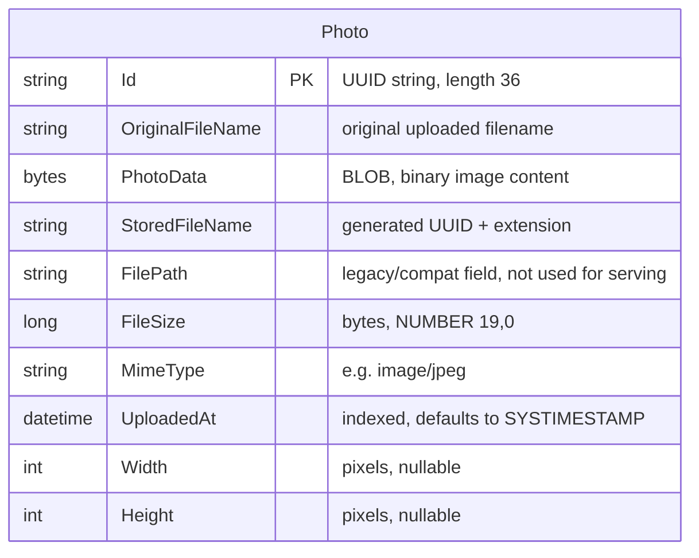

# Data Architecture & Persistence Layer

The data layer consists of a single JPA entity (`Photo`) persisted via Spring Data JPA/Hibernate, with photo binary content stored as a database BLOB rather than on the filesystem.

## Database Configuration

| Service/Module | DB Type | Profile | Driver | Connection | Migration Tool |
|---|---|---|---|---|---|
| photo-album (main app) | Oracle Database (Free/23ai) | default (local dev) | `ojdbc8` (Oracle JDBC, runtime scope) | `jdbc:oracle:thin:@oracle-db:1521/FREEPDB1` (overridable via `SPRING_DATASOURCE_URL`) | None (Hibernate schema generation) |
| photo-album (main app) | Oracle Database (Free/23ai) | `docker` | `ojdbc8` (Oracle JDBC, runtime scope) | Same JDBC URL, injected via Docker Compose environment variables from `.env` | None (Hibernate schema generation) |
| photo-album (test) | H2 (in-memory) | `test` | `org.h2.Driver` | `jdbc:h2:mem:testdb` | None (Hibernate schema generation) |

- Hibernate manages the schema directly; there is no Flyway/Liquibase migration tool in the project. Schema management behavior (`ddl-auto`) differs per profile — see `configuration-inventory.md` for exact property values.
- No seed data files (`data.sql`/`import.sql`) are present; the `photos` table starts empty and is populated only through the upload feature.
- The `oracle-init/` scripts (`01-create-user.sql`, `02-verify-user.sql`, `healthcheck.sh`, `healthcheck.sql`) run at container start to provision the least-privileged `photoalbum` schema user (session/table/sequence/view/procedure/trigger/type/synonym creation grants) — they do not create application tables themselves; Hibernate does that at startup.
- No connection pool tuning (HikariCP sizing, timeouts) is configured beyond Spring Boot defaults.

## Data Ownership per Service

| Service | Tables Owned | ORM Framework | Caching | Notes |
|---|---|---|---|---|
| photo-album (monolith) | `photos` | Hibernate / Spring Data JPA (`JpaRepository`) | None | Single-module application; one entity owns 100% of persisted state, including binary photo data (BLOB) stored inline in the row. |

## Entity Model

There is only one entity (`Photo`, `src/main/java/com/photoalbum/model/Photo.java`); no relationships to other entities exist. An index (`idx_photos_uploaded_at`) is defined on `uploaded_at` to support ordering/navigation queries.

## Key Repository Methods

| Service | Repository | Notable Methods | Purpose |
|---|---|---|---|
| photo-album | `PhotoRepository` (`src/main/java/com/photoalbum/repository/PhotoRepository.java`), extends `JpaRepository<Photo, String>` | `findAllOrderByUploadedAtDesc()` | Native SQL query returning all photos newest-first for the gallery view |
| photo-album | `PhotoRepository` | `findPhotosUploadedBefore(LocalDateTime uploadedAt)` | Native query using `ROWNUM` (Oracle-specific) to fetch up to 10 older photos for "previous" navigation |
| photo-album | `PhotoRepository` | `findPhotosUploadedAfter(LocalDateTime uploadedAt)` | Native query for "next" navigation, ordered ascending |
| photo-album | `PhotoRepository` | `findPhotosByUploadMonth(String year, String month)` | Native query using Oracle `TO_CHAR()` to filter photos by upload year/month |
| photo-album | `PhotoRepository` | `findPhotosWithPagination(int startRow, int endRow)` | Native query using nested `ROWNUM` subqueries for Oracle-style pagination |
| photo-album | `PhotoRepository` | `findPhotosWithStatistics()` | Native query using Oracle analytic functions (`RANK() OVER`, `SUM() OVER`) to compute file-size ranking and running totals; returns raw `Object[]` rows |

All custom queries are Oracle-specific native SQL (`ROWNUM`, `TO_CHAR`, analytic window functions), which is a portability concern for any future database migration. Transaction boundaries are managed at the service layer (`PhotoServiceImpl`) via class-level `@Transactional`, with read-only overrides on query methods.

## Caching Strategy

No caching layer is present. There are no `@Cacheable`/`@CacheEvict` annotations, no JSR-107/JCache usage, and no external cache provider (Redis, EhCache, Caffeine) configured in `pom.xml` or application properties. Every read (gallery listing, photo detail, navigation) hits the database directly, including full BLOB retrieval.

## Data Ownership Boundaries

The application is a single-module monolith with one shared Oracle database instance (per-environment: Oracle in default/docker profiles, H2 in-memory for tests) and no service decomposition — there is no cross-service data access pattern to describe, as `PhotoRepository` is the sole data access point used by `PhotoServiceImpl` and, transitively, the controllers. All reads and writes go through the same repository; there is no CQRS separation.

### Data Classification & Sensitivity

| Entity | Sensitive Fields | Classification | Controls in Place |
|---|---|---|---|
| `Photo` | `photoData` (BLOB image content), `originalFileName` | Potentially PII (uploaded photos and filenames may contain personal/identifying imagery or names) | No encryption-at-rest, no data masking, and no field-level access control configured; BLOB is stored and retrieved in plaintext by Hibernate. Access to upload/delete is restricted at the application layer via `SecurityConfig`, but stored data itself is unencrypted. |
