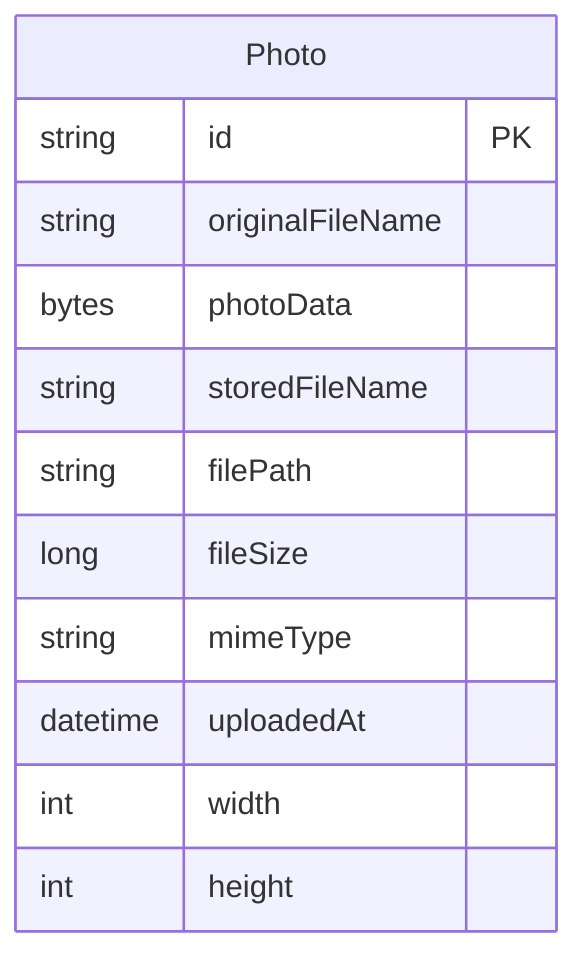

# Data Architecture & Persistence Layer

One JPA entity, `Photo`, persists image bytes and metadata in a single relational table. Hibernate maps the entity to PostgreSQL for application runs and H2 for tests.

## Database Configuration

| Service/Module | DB Type | Profile | Driver | Connection | Migration Tool |
| --- | --- | --- | --- | --- | --- |
| Photo album | PostgreSQL | Default (including Azure) | PostgreSQL JDBC driver; Spring Cloud Azure JDBC PostgreSQL integration for passwordless authentication | Environment-overridable JDBC URL, defaulting to `jdbc:postgresql://postgres-db:5432/photoalbum`; Azure Service Connector can inject the URL and username for Microsoft Entra authentication. Hibernate updates the existing schema by default. | None; Hibernate manages schema changes. |
| Photo album | PostgreSQL | `docker` | PostgreSQL JDBC driver | Environment-overridable JDBC URL, defaulting to `jdbc:postgresql://postgres-db:5432/photoalbum`; application username and password supplied through environment variables. Hibernate recreates the schema at startup. | None; PostgreSQL initialization creates the application role and grants schema ownership, not application tables. |
| Photo album tests | H2 (in memory) | `test` | H2 JDBC driver (test scope) | `jdbc:h2:mem:testdb`; Hibernate creates and drops the schema for the test context. | None. |

No explicit connection-pool size or custom pooling configuration was found; the JPA starter supplies the default datasource pooling behavior. No versioned migrations, application schema SQL scripts, or seed data were found. See `configuration-inventory.md` for the property inventory. Sources: `pom.xml`, `src/main/resources/application.properties`, `src/main/resources/application-docker.properties`, `src/test/resources/application-test.properties`, `postgres-init/01-init-schema.sh`.

## Data Ownership per Service

| Service | Tables Owned | ORM Framework | Caching | Notes |
| --- | --- | --- | --- | --- |
| Photo album (`PhotoServiceImpl` / `PhotoRepository`) | `photos` | Spring Data JPA / Hibernate | No application or ORM second-level cache configured | Owns both photo metadata and binary payload in the same table; no other independently persisted module identified. |

## Entity Model

`Photo` is mapped in `src/main/java/com/photoalbum/model/Photo.java`. Its string ID is generated as a UUID by the Java constructor (not a database-generated key); `photo_data` is a nullable materialized BLOB mapped to PostgreSQL `bytea`. `file_path` is retained for compatibility but the image bytes live in the database. The upload timestamp has an index; the filename, size, MIME type, and timestamp columns are non-null, while dimensions are optional. `UploadResult` is a non-persistent result object. No JPA relationships or foreign keys are defined.

The photo album service owns the sole entity; there are no relationship edges to draw. `PhotoServiceImpl` has a class-level `@Transactional` boundary, with read-only transactions on retrieval and navigation methods; upload and delete use the class-level transaction. Sources: `src/main/java/com/photoalbum/model/Photo.java`, `src/main/java/com/photoalbum/service/impl/PhotoServiceImpl.java`.

## Key Repository Methods

`PhotoRepository` (`src/main/java/com/photoalbum/repository/PhotoRepository.java`) extends `JpaRepository<Photo, String>`; the table below focuses on its custom native SQL methods.

| Service | Repository | Notable Methods | Purpose |
| --- | --- | --- | --- |
| Photo album | `PhotoRepository` | `List<Photo> findAllOrderByUploadedAtDesc()` | Returns photos newest first. |
| Photo album | `PhotoRepository` | `List<Photo> findPhotosUploadedBefore(LocalDateTime uploadedAt)` | Returns up to ten earlier photos in descending timestamp order. |
| Photo album | `PhotoRepository` | `List<Photo> findPhotosUploadedAfter(LocalDateTime uploadedAt)` | Returns later photos in ascending timestamp order; substitutes a default for null `file_path` in its native projection. |
| Photo album | `PhotoRepository` | `List<Photo> findPhotosByUploadMonth(String year, String month)` | Filters by year and month using PostgreSQL `TO_CHAR`. |
| Photo album | `PhotoRepository` | `List<Photo> findPhotosWithPagination(int startRow, int endRow)` | Uses PostgreSQL `LIMIT`/`OFFSET` for a 1-based inclusive row range. |
| Photo album | `PhotoRepository` | `List<Object[]> findPhotosWithStatistics()` | Returns photo columns plus size rank and running byte total from window functions. |

These queries select `photo_data` along with metadata; no bulk cross-service aggregation query, named query, or stored procedure was found. Standard inherited methods used by the service include lookup, save, and delete, but are omitted from the table.

## Caching Strategy

No Spring Cache annotations, cache provider, JCache binding, cache regions, TTL, eviction policy, or Hibernate second-level/query cache configuration was found. Reads access the repository rather than an application cache. Photo binary responses explicitly set no-cache/no-store headers, and security configuration uses stateless sessions; no session-backed cache is configured. There is no documented cache-aside, read-through, write-through, or write-behind strategy.

## Data Ownership Boundaries

The single service uses one database and one table for both metadata and image bytes; there is no database-per-service boundary or cross-service data access. Controllers call the photo service, which reads and writes through `PhotoRepository`; no separate read/write stores or CQRS model were found. All custom queries are local to the `photos` table.

### Data Classification & Sensitivity

| Entity | Sensitive Fields | Classification (PII/PHI/PCI/None) | Controls in Place |
| --- | --- | --- | --- |
| `Photo` | `originalFileName`, `photoData` (images may contain identifiable people or embedded personal information) | Potential PII; no explicit PHI or PCI fields | Authentication protects writes, but reads are public. No field-level access control, data masking, or application-configured encryption at rest was found; database/platform-level encryption is not established by these files. |
