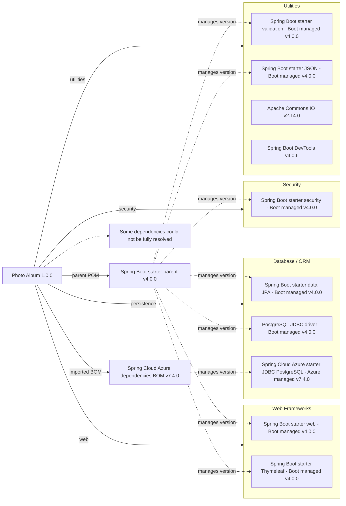

# Dependency Map

Photo Album declares 12 external dependencies in `pom.xml`: 10 application dependencies and 2 test-scope dependencies. Versions without explicit numbers are managed by the Spring Boot parent or the imported Spring Cloud Azure BOM; their resolved artifact versions are not specified in this POM.

## Dependencies

### Dependency Summary

| Category | Count | Key Libraries | Notes |
| --- | ---: | --- | --- |
| Web Frameworks | 2 | `org.springframework.boot:spring-boot-starter-web`, `org.springframework.boot:spring-boot-starter-thymeleaf` (Boot managed) | HTTP and server-side templates; default compile scope. |
| Database / ORM | 3 | `org.springframework.boot:spring-boot-starter-data-jpa` (Boot managed), `org.postgresql:postgresql` (Boot managed), `com.azure.spring:spring-cloud-azure-starter-jdbc-postgresql` (Azure BOM managed) | PostgreSQL driver has runtime scope; JPA and Azure JDBC starter have default compile scope. |
| Security | 1 | `org.springframework.boot:spring-boot-starter-security` (Boot managed) | Default compile scope. |
| Utilities | 4 | `org.springframework.boot:spring-boot-starter-validation`, `org.springframework.boot:spring-boot-starter-json` (Boot managed); `commons-io:commons-io` 2.14.0; `org.springframework.boot:spring-boot-devtools` 4.0.6 | Default compile scope; DevTools is optional. |

### Version & Compatibility Risks

The parent is Spring Boot 4.0.0 with Java 25, while DevTools is explicitly pinned to 4.0.6; align these versions when updating the Boot stack to avoid mixed-release behavior. Commons IO is pinned to 2.14.0 rather than BOM-managed. The Azure JDBC starter is managed by Spring Cloud Azure BOM 7.4.0, so compatibility with the Boot 4.x stack should be reviewed on upgrades. The exact managed artifact versions and transitive dependencies cannot be determined from this POM alone.

### Notable Observations

- The PostgreSQL JDBC driver is runtime-scoped, while the Azure PostgreSQL JDBC starter is compile-scoped and versioned by a separate BOM.
- The parent POM governs the unversioned Spring Boot starters and PostgreSQL driver; the Azure BOM governs the Azure JDBC starter.
- DevTools is optional but explicitly pinned to a different Spring Boot patch release from the parent.

## Test Dependencies

| Framework | Version | Notes |
| --- | --- | --- |
| `org.springframework.boot:spring-boot-starter-test` | Managed by Spring Boot parent 4.0.0 | Test-scope starter; underlying test libraries are not enumerated in this POM. |
| `com.h2database:h2` | Managed by Spring Boot parent 4.0.0 | Test-scope in-memory database. |

Total test-scope dependencies: 2.

The test configuration declares H2 but no test-scoped PostgreSQL integration or contract-testing framework. Resolved test and transitive library versions are not available from the declared POM alone.
