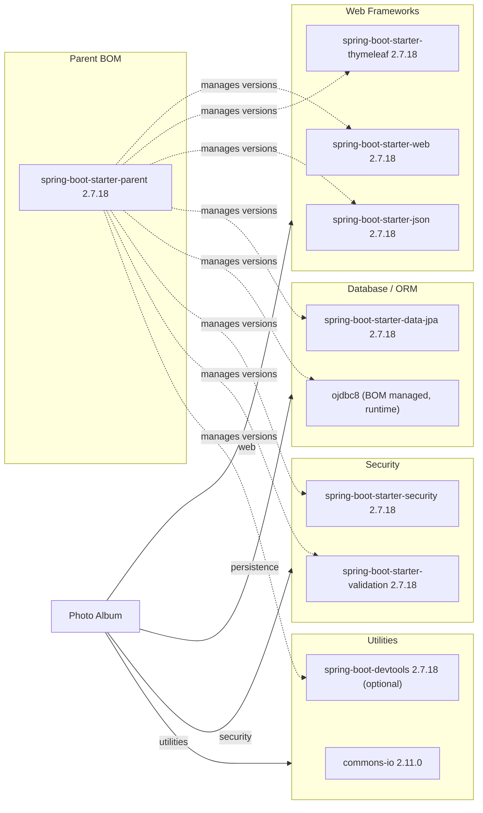

# Dependency Map

Photo Album is a Spring Boot 2.7.18 Java application (Maven, `com.photoalbum:photo-album`) with 9 main-scope declared dependencies plus 2 test-scope dependencies.

## Dependencies

### Dependency Summary

| Category | Count | Key Libraries | Notes |
|----------|-------|----------------|-------|
| Web Frameworks | 3 | spring-boot-starter-web 2.7.18, spring-boot-starter-thymeleaf 2.7.18, spring-boot-starter-json 2.7.18 | Standard Spring MVC + server-side Thymeleaf templating stack |
| Database / ORM | 2 | spring-boot-starter-data-jpa 2.7.18, ojdbc8 (Oracle JDBC, runtime, version managed by Spring Boot BOM) | Oracle DB backend via Hibernate/JPA |
| Security | 2 | spring-boot-starter-security 2.7.18, spring-boot-starter-validation 2.7.18 | Protects state-changing endpoints; bean validation for form/DTO input |
| Utilities | 2 | commons-io 2.11.0, spring-boot-devtools 2.7.18 (optional, dev-only) | File I/O helpers for image/album storage; devtools excluded from production artifact |

No dedicated Messaging, Caching, Logging, or Observability dependencies are declared explicitly — logging is provided transitively via `spring-boot-starter-web`/`spring-boot-starter-logging` (Logback + SLF4J) as part of the Spring Boot BOM.

### Version & Compatibility Risks

The project targets Java 8 and Spring Boot 2.7.18, the final release in the Spring Boot 2.7.x line, which reached end of OSS support in November 2023 (commercial support only via Tanzu). Upgrading to Spring Boot 3.x requires a Java 17 baseline and migration from `javax.*` to `jakarta.*` namespaces (affecting `spring-boot-starter-validation`, JPA, and Thymeleaf integration). The Oracle JDBC driver (`ojdbc8`) version is implicitly managed by the Spring Boot BOM rather than pinned explicitly, which can lead to unexpected driver upgrades/downgrades on parent version bumps and should be verified against the Oracle DB version in use. `commons-io 2.11.0` is current at time of writing but should be checked against latest CVE advisories.

### Notable Observations

- No explicit logging, caching, messaging, or observability libraries are declared — all such capabilities (if used) come transitively through Spring Boot starters, meaning capacity for structured logging/metrics/tracing is minimal without adding Micrometer/OpenTelemetry.
- All Spring Boot starter versions are centrally managed by the `spring-boot-starter-parent` BOM (2.7.18), so a single version bump upgrades the whole stack consistently — but also ties the app to Spring Boot's 2.7.x EOL constraints.
- `spring-boot-devtools` is marked `optional`, correctly preventing it from being bundled in production builds.
- The application couples directly to Oracle DB via `ojdbc8`, a proprietary driver, which is a portability consideration for any future cloud-database migration (e.g., to PostgreSQL or Azure SQL).

## Test Dependencies

| Framework | Version | Notes |
|-----------|---------|-------|
| spring-boot-starter-test | 2.7.18 (BOM managed) | Aggregates JUnit 5, Mockito, AssertJ, Hamcrest, Spring Test |
| h2 | (BOM managed, test scope) | In-memory database used to replace Oracle for test execution |

Total test-scope dependencies: 2

No dedicated integration-testing framework (e.g., Testcontainers) is present; tests rely on the H2 in-memory database as an Oracle substitute, which may not fully validate Oracle-specific SQL/JPA behavior.
